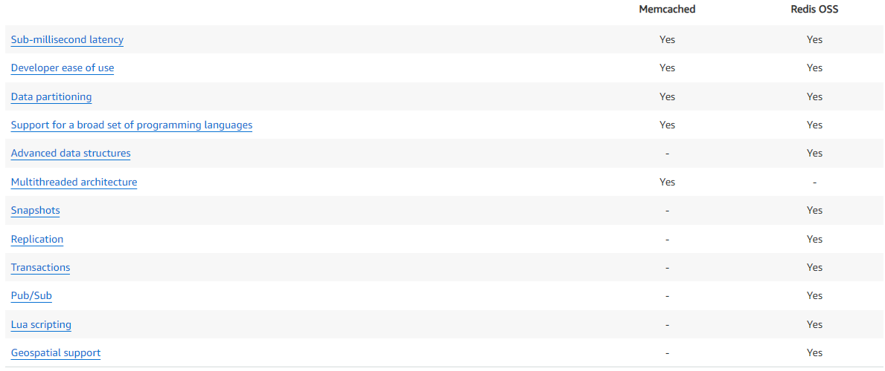

# Redis vs Memcached Comparison

## Redis

- **High Availability**: Supports Multi-AZ deployments with automatic failover, enhancing availability.
- **Scalability**: Offers read replicas to scale out reads and improve application performance.
- **Data Durability**: Utilizes AOF (Append Only File) persistence for data durability, ensuring data is not lost on restarts.
- **Data Structures**: Provides a rich set of data structures like Sets and Sorted Sets, offering more flexibility for application developers.

## Memcached

- **Partitioning**: Supports multi-node environments for partitioning of data (sharding), which can distribute the load across multiple servers.
- **High Availability**: Lacks built-in replication and auto-failover mechanisms, making it less suitable for scenarios requiring high availability.
- **Persistence**: Data is not persistent; it is stored in memory and will be lost if the server restarts.
- **Backup and Restore**: Does not support native backup and restore functionalities.
- **Performance**: Benefits from a multi-threaded architecture, which can handle high levels of concurrency.

